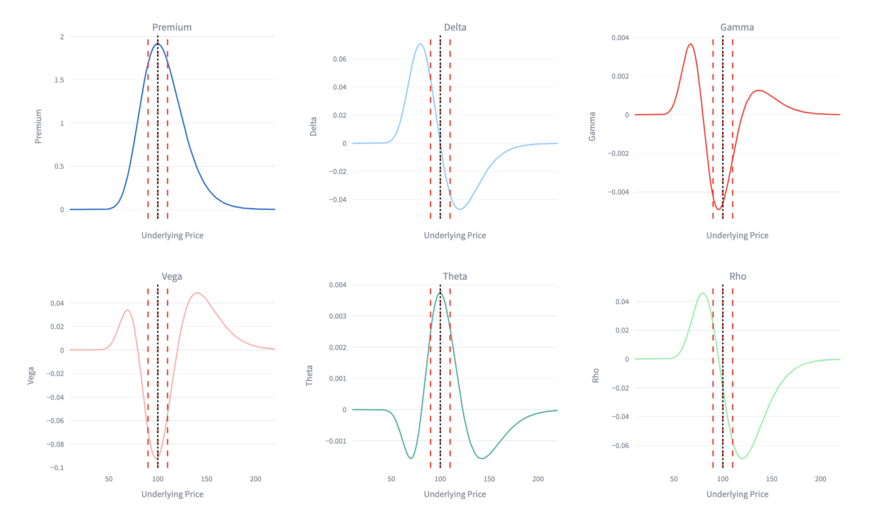

# Structured-Products
Developed a pricing and stress testing framework for structured products (e.g. autocallables, barriers) and basic strategies for options using Python. Implemented Monte Carlo and volatility-based models for payoff valuation. Simulated market shocks to assess product behavior under stress scenarios. Included visual and numerical analysis of payoffs across market conditions.

## 📽️ Demo: Basic Option Strategies

This demo showcases pricing of Asian and barrier options using Monte Carlo simulations. Interactive controls are powered by Streamlit, with live payoff graphs and barrier status indicators.
